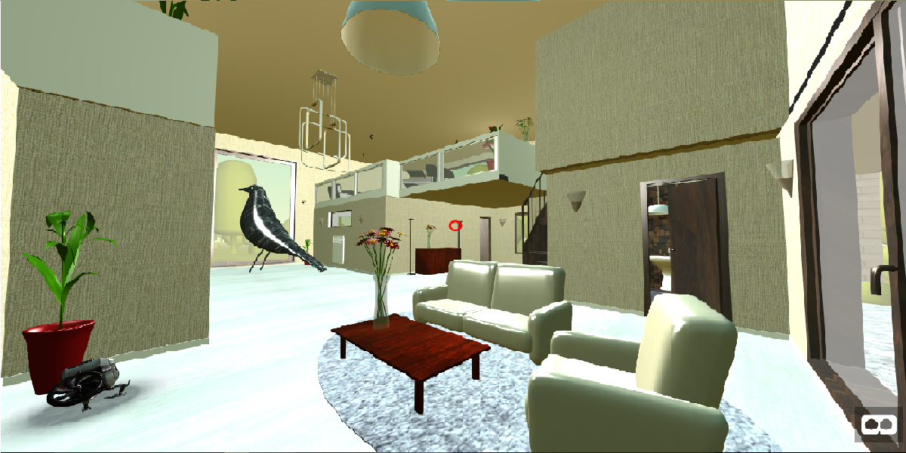
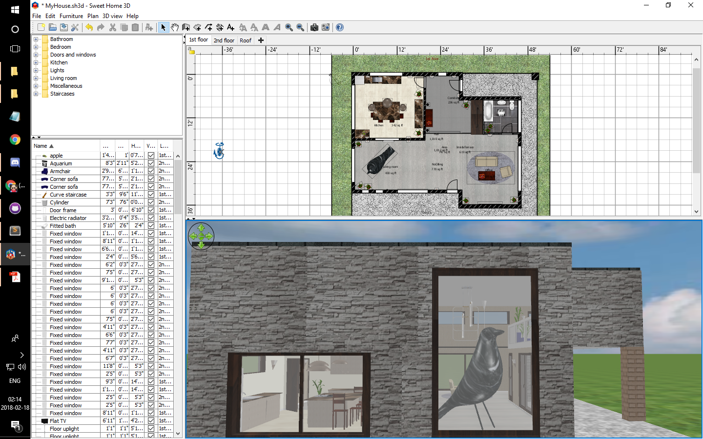
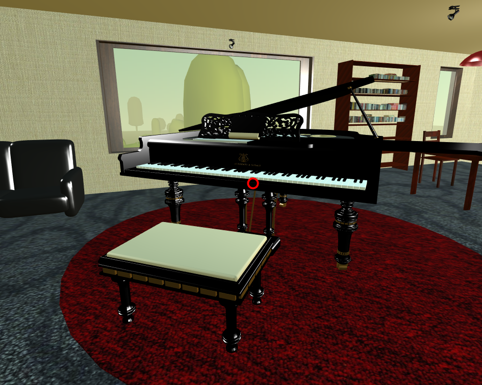
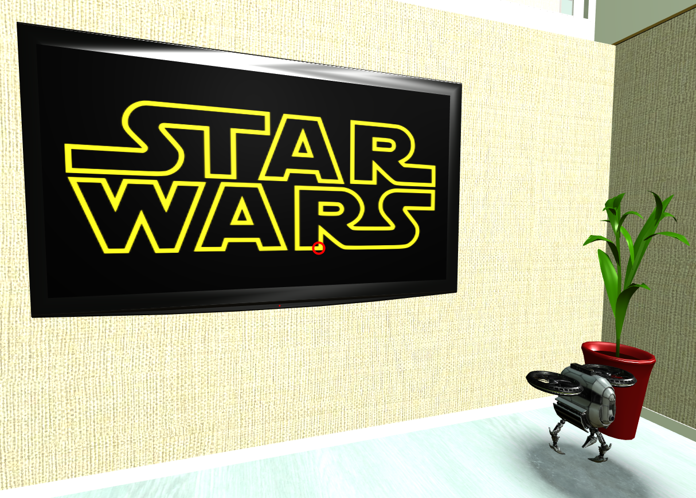
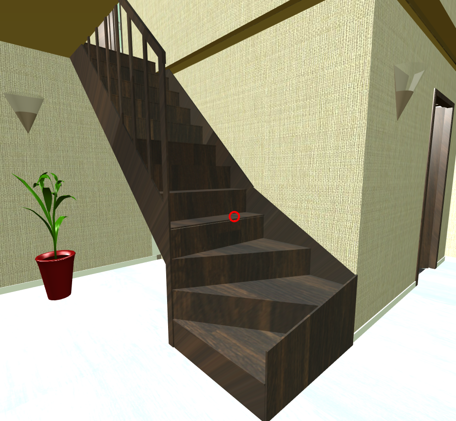
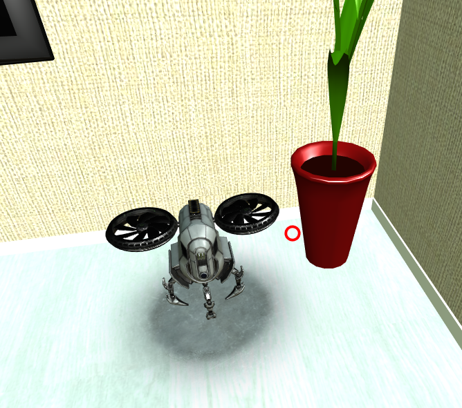
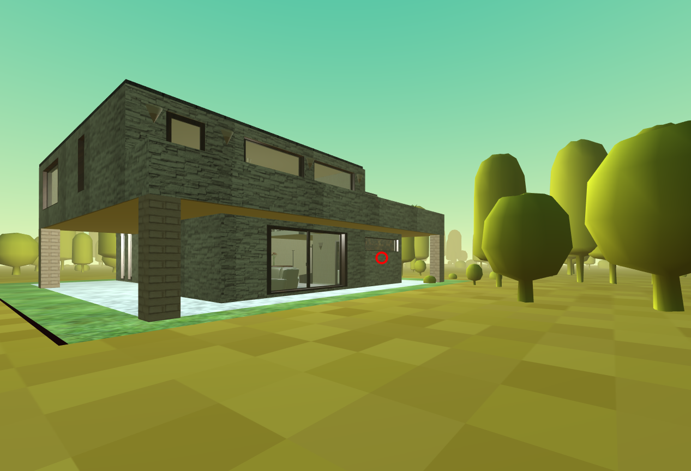

# Project 1 Report

This is an individual project for CS5331 Virtual Reality course, Spring 2018, TTU.

The project demo can be acces through the file [Livingroom.html](https://rawgit.com/gchalump/CS5331-Virtual-Reality-TTU/master/Project1/Livingroom.html)

The vido demo can be found at [VDO](http://www.youtube.com/) - The web framework used

Screen short of the project

## Getting Started

This project is created with A frame. 

### Rooms Plan and Static Models

A frame doesn't provide a convienet tool for 3d model editing. To create a room (with floor, wall, and ceiling) I used a tool named Sweet Home 3D [Link](http://www.sweethome3d.com/download.jsp/). This is a 3d modeling tool that designed for create floor plan.

For the static furniture (without animation), I integrated them in to the room and imported them as a single object in this way the code in A frame would be cleaner to read.

The Sweet Home 3D has some free furniture model that can be import to our model. However it doesn't provide the textures, but external texture can be imported. The list of models that I used are shown in followint pdf files.|
* [1st floor](https://github.com/gchalump/CS5331-Virtual-Reality-TTU/blob/master/Project1/Report/MyHouse1.pdf)
* [2nd floor](https://github.com/gchalump/CS5331-Virtual-Reality-TTU/blob/master/Project1/Report/MyHouse2.pdf)

### Interactived Objects

I created three interactive Objects

#### The Piano
When click on the piano on second floor, It will play the piano sound.

#### The Television
At first floor in the living room, the big flat screen television will show image and play sound when clicked.

#### Stairs
When click on the stairs on the first floor, the camera (you) will be moved up to the second floor.
In the other hand when click on the stairs on the second floor, the camera (you) will be moved down to the first floor.

### Animated glTF Objects
As A-frame support [glTF](https://www.khronos.org/gltf/) file type, which is a 3D object file. The glTF can contain mesh, texture, and animation which easier to use compare to other types. I add the model called [busterDrone](https://sketchfab.com/models/294e79652f494130ad2ab00a13fdbafd). You can find it flying beside the big flat screen television at the first floor.

### Environment
Since I create a lot of windows in my room, adding a bit of out door environment would be a good idea. I used extra liblary called [aframe-environment-component](https://github.com/feiss/aframe-environment-component) to create a 'forest' preset environment.

